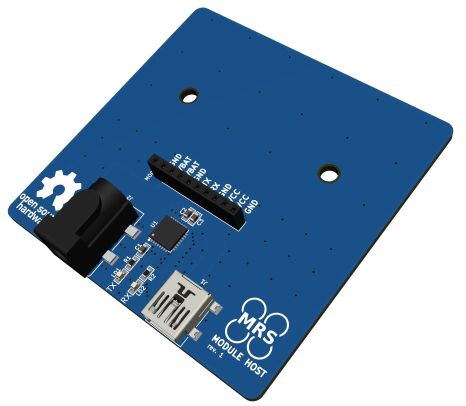

# MRS Modules
Modules for MRS drone distribution boards to add a specific funtionality the distribution boards do not provide.

These modules are equipped with 1x10 header with 2mm pitch providing the module with UART connection, 5V from USB and VBAT from battery.

## MRS Module Host

This PCB serves as a host for MRS Modules for development. It's functionality is simple: provide power for VBAT pins (can be supplied using the 5.5/2.5mm barrel connector), power for the module's MCU and serial communication between the user's computer and the module's MCU (usinng the USB2.0B mini connector).

The VBAT input of the module is designed to be either 4S or 6S LiPo battery, but can be anything the designed module is capable of. Check the module's VBAT capabilities before plugging in any power source in case it is unsuitable and could damage the module.

## MRS Module Templates
Three templates are provided in case you aim to implement your own module: Small, Medium and Large.
